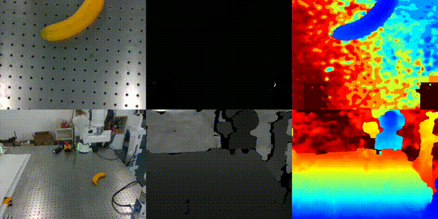

# hdf5-to-video
# HDF5 to Video Converter

Convert HDF5 image sequences to video files with multi-camera support.

## Installation
```bash
pip install h5py opencv-python numpy tqdm
```
## Example Effect
```bash
python hdf5_to_video.py 17.hdf5 output_folder/ --layout camera_grouped
```


data format: refer to data_format.png

## Usage

### Basic Commands
```bash
# Auto-detect and convert all cameras
python hdf5_to_video.py input.h5 output_folder/

# List HDF5 contents first
python hdf5_to_video.py input.h5 output_folder/ --list
```

### Layout Options
```bash
# Separate video per camera (default)
python hdf5_to_video.py input.h5 output/ --layout separate

# Side-by-side cameras
python hdf5_to_video.py input.h5 output/ --layout side_by_side

# Cameras stacked vertically
python hdf5_to_video.py input.h5 output/ --layout top_bottom

# Group by camera (recommended for multi-stream)
python hdf5_to_video.py input.h5 output/ --layout camera_grouped --camera-info-count 3
```

### Manual Dataset Selection
```bash
python hdf5_to_video.py input.h5 output/ --datasets camera1_rgb camera1_depth camera2_rgb camera2_depth
```

### Options
- `--fps 25`: Set frame rate
- `--codec XVID`: Set video codec
- `--camera-info-count 3`: Streams per camera for grouped layout

## Python API
```python
from hdf5_to_video import hdf5_to_video_multi_camera

# Camera-grouped layout
hdf5_to_video_multi_camera('data.h5', 'output/', layout='camera_grouped', camera_info_count=3)

# Separate videos
hdf5_to_video_multi_camera('data.h5', 'output/', layout='separate')
```

## Dataset Naming
For auto-grouping, name datasets like:
- `color_gripper`, `depth_gripper`, `color_static`, `depth_static`
- `camera1_rgb`, `camera1_depth`, `camera2_rgb`, `camera2_depth`

## Output
- `separate`: `camera1.mp4`, `camera2.mp4`
- `side_by_side`: `combined_horizontal.mp4`
- `top_bottom`: `combined_vertical.mp4`
- `camera_grouped`: `camera_grouped.mp4`
